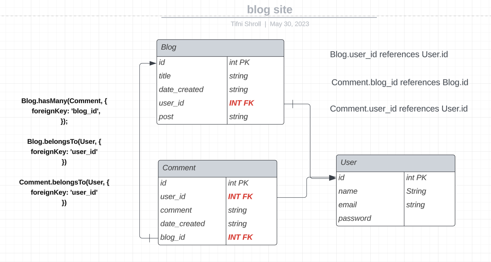
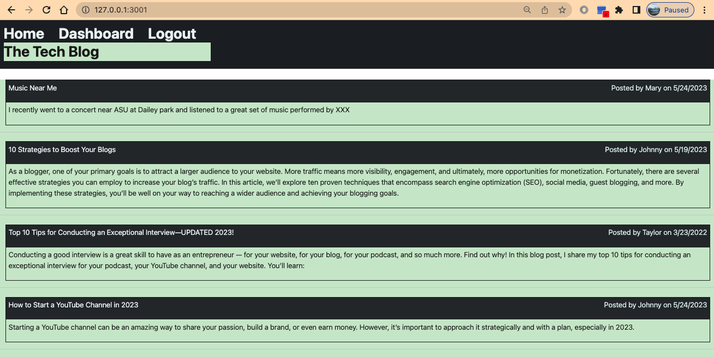
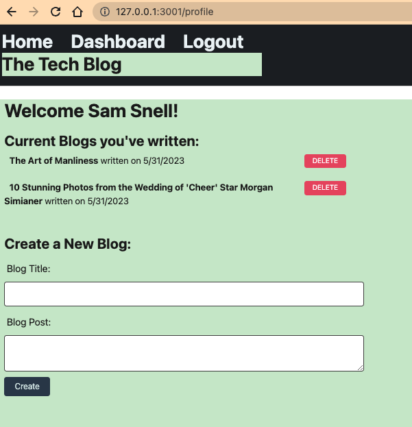
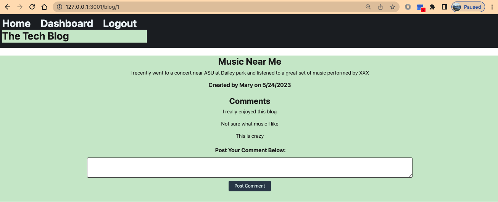

# best-blog-site

Blog site application that allow developers to publish blog posts and comment on other posts about technical concepts, recent advancements, and new technologies.

# Description

This application follows MVC methodology to relate the user front end to back end SQL data models. The three tables used to track data are Blog, User, Comment. Users are presented a homepage which includes existing blog posts if they exist. Users are prompted to signup/login to view blog details, create and delete blogs, and make comments on other blogs. The app will authenticate user credentials and save their session. The app uses the following packages: express-handlebars, mySQL2, Sequelize, and bcrypt. 


[](n/a)

# Git Hub Repository
https://github.com/tasshroll/best-blog-site

# Heroku Deployed App


# Screenshots

Visual for associations between 3 tables in blog_db: Blog, Comment, User

PK = Primary Key, FK = Foreign Key



Homepage display of all blogs



Profile display of all users contributions



Comment display



## Table of Contents

[Installation & Usage](#installation--usage)

[User Story](#user-story)

[Acceptance Criteria](#acceptance-criteria)

# Installation & Usage

Run from Heroku. 

To run on command line do these steps:

1. Set up the environment by installing node package manager:

	* npm i 


2. Create the schema from the MySQL shell.

	* mysql
	* source {path}/schema.sql 
	* exit


3. Seed the database from the command line, OPTIONAL check of the contents of product table:

	* node ./seeds/seed.js
	* mysql

4. Start the server. Response is, "App listening on port 3001!"

	* node server.js


5. Test - Open insomnia to simulate the front-end. Insomnia is a open-source RESTful API client that allows developers to test and interact with APIs. It provides a user-friendly interface for sending HTTP requests. From insomnia, use the following endpoints to test


## User Story

```md
AS A developer who writes about tech
I WANT a CMS-style blog site
SO THAT I can publish articles, blog posts, and my thoughts and opinions
```

## Acceptance Criteria

```md
GIVEN a CMS-style blog site
WHEN I visit the site for the first time
THEN I am presented with the homepage, which includes existing blog posts if any have been posted; navigation links for the homepage and the dashboard; and the option to log in
WHEN I click on the homepage option
THEN I am taken to the homepage
WHEN I click on any other links in the navigation
THEN I am prompted to either sign up or sign in
WHEN I choose to sign up
THEN I am prompted to create a username and password
WHEN I click on the sign-up button
THEN my user credentials are saved and I am logged into the site
WHEN I revisit the site at a later time and choose to sign in
THEN I am prompted to enter my username and password
WHEN I am signed in to the site
THEN I see navigation links for the homepage, the dashboard, and the option to log out
WHEN I click on the homepage option in the navigation
THEN I am taken to the homepage and presented with existing blog posts that include the post title and the date created
WHEN I click on an existing blog post
THEN I am presented with the post title, contents, post creator’s username, and date created for that post and have the option to leave a comment
WHEN I enter a comment and click on the submit button while signed in
THEN the comment is saved and the post is updated to display the comment, the comment creator’s username, and the date created
WHEN I click on the dashboard option in the navigation
THEN I am taken to the dashboard and presented with any blog posts I have already created and the option to add a new blog post
WHEN I click on the button to add a new blog post
THEN I am prompted to enter both a title and contents for my blog post
WHEN I click on the button to create a new blog post
THEN the title and contents of my post are saved and I am taken back to an updated dashboard with my new blog post
WHEN I click on one of my existing posts in the dashboard
THEN I am able to delete or update my post and taken back to an updated dashboard
WHEN I click on the logout option in the navigation
THEN I am signed out of the site
WHEN I am idle on the site for more than a set time
THEN I am able to view posts and comments but I am prompted to log in again before I can add, update, or delete posts
```

